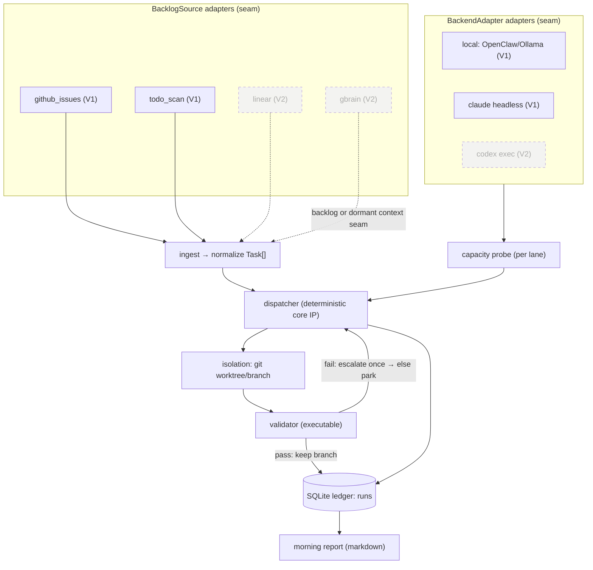
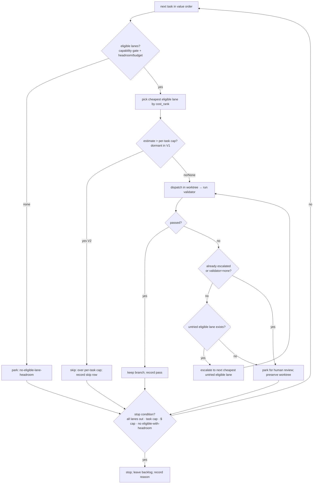
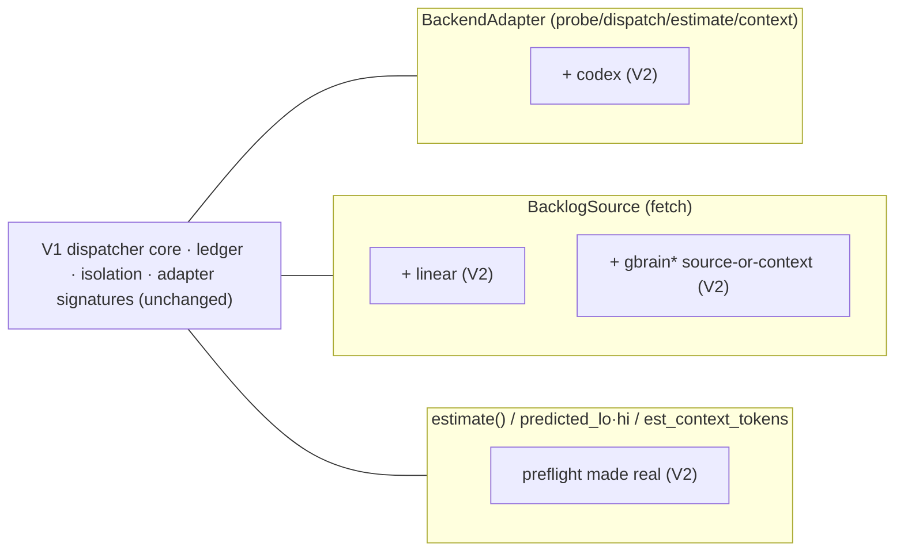

# feat: Nightsweeper — local-first capacity-aware overnight scheduler (V1)

## Summary

Build V1 of Nightsweeper: a local Python CLI, launched nightly by launchd, that pulls a real backlog (GitHub issues + a TODO/FIXME scan), probes which paid-for lane has idle capacity tonight (local Ollama at $0; Claude headless gated by a per-night $ budget), dispatches each task in value order to the cheapest lane that can plausibly clear its validator, validates each result inside an isolated git worktree, leaves a labeled branch per pass, records every attempt in a SQLite ledger, and writes an honest markdown morning report. The two adapter interfaces (`BackendAdapter`, `BacklogSource`) are built in V1 with two dormant hooks — a preflight `estimate()` and a `dispatch()` `context` parameter — plus the `predicted_lo/hi` ledger columns, so V2 (Codex lane, Linear/Gbrain sources, cost prediction) lands as new adapters with no signature or schema change.

This plan covers **V1 in build detail** and **V2 as a roadmap whose seams V1 designs in**. Build starts only after this plan is approved; the first milestone is three decision-gating spikes.

---

## Problem Frame

Flat-rate subscriptions plus an always-on Mac are idle, pre-paid capacity overnight, yet no tool matches a real backlog to that capacity and executes it. The scarce resource is idle agent capacity on infrastructure already paid for. V1 must prove the loop end-to-end on a real backlog without inventing work, while honestly reporting consumption — including recommending a downgrade when a paid lane is underused.

---

## Requirements

Traceability to the origin requirements doc (R1–R28). Grouped by concern; R-IDs are the origin's.

**Ingest** — R1 (real sources only, no invented work), R2 (normalize Task shape), R3 (GitHub issues + TODO scan; value from source signals).
**Capacity** — R4 (probe per lane), R5 (budget fallback when headroom opaque), R6 (cloud lanes not free).
**Dispatch (core IP)** — R7 (value order), R8 (cheapest lane with headroom that can plausibly clear the validator; local-first), R9 (deterministic only), R10 (escalate off local only on validation failure, once), R11 (then park).
**Validation & isolation** — R12 (keep only passes), R13 (one worktree/branch per task), R14 (labeled branch; PR opt-in), R15 (preserve parked state).
**Ledger & report** — R16 (`runs` schema incl. nullable `predicted_lo/hi`), R17 (what ran/passed/per-lane consumption/backlog remaining), R18 (downgrade recommendation), R19 (markdown artifact), R20 (consumption never used to rank).
**Config & runtime** — R21 (single `nightsweeper.config.yaml`), R22 (local cron/launchd, no hosted dependency/telemetry), R23 (local SQLite), R24 (nightly task/$ caps + per-task cap as hard stops).
**Guardrails (first-class)** — R25 never invent work, R26 rank by value not tokens, R27 willing to recommend downgrade, R28 local-only-free.

---

## Key Technical Decisions

- **KTD1 — Two adapter seams are the only API-wrapper-shaped code, and both V2 hooks exist (dormant) from day one.** `BackendAdapter` exposes `name`, `cost_rank: int`, `probe_headroom() -> Capacity`, `dispatch(task, workdir, context=None) -> Result`, and `estimate(task) -> CostRange | None`. In V1 `estimate()` returns `None` and `context` is ignored; they are the V2 preflight and Gbrain-enricher seams, present now so V2 changes no signature. `BacklogSource` exposes `name` and `fetch() -> list[Task]`. Backends and sources are registered in a config-driven registry, so V2 adapters drop in without touching the dispatcher. (R1–R4, see origin.)

- **KTD2 — Claude lane is budget-gated and fail-closed, with honest V1 semantics.** Live remaining headroom is not programmatically readable on a subscription machine (grounding §2), and headless `claude -p` now bills a separate, capped monthly credit (grounding §1). So `probe_headroom()` returns `available = (nightly_budget − spent_tonight) > 0` with `dollars_remaining = nightly_budget − spent_tonight`, where `spent_tonight` is summed from the ledger. V1 has **no pre-dispatch cost estimate** (`estimate()` is dormant), so the nightly $ cap is enforced **after each task** via a post-run re-probe; a single task may overshoot the cap by its own spend (bounded, accepted in V1). An optional **static** configured per-task floor lets the lane refuse obviously-too-large tasks before dispatch without an estimate. Fail-closed: when remaining budget is non-positive the lane is unavailable and the night stops cleanly. Dispatch runs with `env -u ANTHROPIC_API_KEY`, and a hard pre-assert aborts if that key is set; S1 verifies spend routes to the Agent SDK credit, not uncapped API. (R5, R6, R24, R28.)

- **KTD3 — Local lane = OpenClaw over Ollama; default model Qwen3-Coder-30B, not gemma.** Grounding §3: gemma is not a coding specialist; Qwen3-Coder-30B-A3B is the agentic local workhorse. The model is config-driven; gemma remains selectable as a generalist for non-agentic helper steps. `probe_headroom()` always returns "available, $0" — the local lane needs **no headroom spike** because it is unconditionally free and capacity-bounded only by the machine. Every local result is gated on **executable** validation, never self-report. (R4, R6, R8.)

- **KTD4 — "Plausibly clear the validator" = a deterministic capability matrix, no ML, and capability never leaks into selection.** Config maps each lane to the validator types it may attempt and a max task-complexity tier it is trusted for. A lane is *eligible* for a task when it passes the capability gate AND has headroom/budget. Among eligible lanes the dispatcher picks the cheapest by `cost_rank` **only** — `est_complexity`/`est_context_tokens` gate eligibility (a capability fact) but never order or select among already-eligible lanes, so value-ordering is never quietly replaced by cost-ordering (R26). The complexity-tier cutoffs are set **only** from S3's measured pass-rate-by-complexity, not asserted. The capability gate may exclude local for a high-complexity task, so "local-first" means *prefer local when eligible*, not *always try local first*. Validation + a single escalation is the safety net for misclassification. Tasks with `validator: none` cannot be auto-passed and always park for human review. (R8, R9.)

- **KTD5 — Worktree isolation per task, push-then-optional-PR handoff.** `git worktree add .nightsweeper/worktrees/<task-id> -b nightsweeper/<task-id> origin/HEAD`; seed gitignored config via a `.worktreeinclude`-style copy; validate inside the worktree; on pass, `git push -u origin HEAD` then optionally `gh pr create --draft` (config toggle, default off); cleanup with `git worktree remove` + `prune`, resetting any `extensions.worktreeConfig` leftover. (R13, R14, grounding §5.)

- **KTD6 — Runtime: launchd LaunchAgent + caffeinate + pmset, with a scheduler-agnostic flock and sentinel self-heal.** A per-user `StartCalendarInterval` LaunchAgent runs the job under `caffeinate -is`; `pmset repeat wakeorpoweron` guarantees wake; a `flock` lockfile enforces single-instance even under cron/Linux; a sentinel file plus a "last successful run date" check lets the next launch detect and self-heal a run missed because the Mac was off, without double-running. (R22, grounding §6.)

- **KTD7 — Stack: Python 3.12 + stdlib + PyYAML.** `subprocess` orchestrates the agent CLIs; `sqlite3` is the ledger; PyYAML reads config. One console-script entrypoint (`nightsweeper`). (R21–R23.)

- **KTD8 — SQLite ledger schema is stable from V1.** `runs(task_id, source, backend, predicted_lo, predicted_hi, consumed, validation_result, passed, escalated, branch, ts)` with `predicted_lo/hi` nullable until V2's preflight populates them. Consumption is recorded for economics only, never used to order tasks. (R16, R20.)

- **KTD9 — Stop conditions are hard, plus an efficiency early-stop.** A night ends on the first of: all eligible lanes out of headroom/budget; nightly task cap reached; nightly $ cap reached; **or** no remaining task has any eligible lane with headroom (early-stop — don't iterate-and-park the whole backlog for zero work). A task whose only capability-eligible lanes are all out of headroom/budget is **parked** (reason `no-eligible-lane-headroom`) and the night continues; the night *stops* only on the four conditions above. The remaining backlog is left intact and the stop reason is recorded. (R24, F3.)

- **KTD10 — Preflight hook is present but dormant in V1.** The dispatcher calls `backend.estimate(task)` (returns `None` in V1), records `predicted_lo/hi` (NULL), and contains an inert "skip if estimate exceeds per-task cap" branch. When that branch activates in V2 it records a skip row and **falls through to the stop-condition check**, identical to park — so activating it changes no loop invariant. The per-task cap is accepted and validated in V1 config but enforced only in V2; config-load warns that it is inert in V1. (Designs the V2 seam; R16, R24.)

---

## High-Level Technical Design

### Component topology and the V1/V2 seam



Solid = V1; dashed = V2, attaching only at the two seams and the dormant `estimate()`/`context` hooks.

### Nightly run sequence

```mermaid
sequenceDiagram
  participant LA as launchd (caffeinate)
  participant NS as nightsweeper run
  participant SRC as BacklogSources
  participant CAP as Capacity probe
  participant DSP as Dispatcher
  participant ISO as Worktree
  participant VAL as Validator
  participant LED as Ledger

  LA->>NS: 03:00, flock acquired, sentinel + last-run-date checked
  NS->>SRC: fetch() all sources
  SRC-->>NS: Task[] (or none → "no backlog, no run")
  NS->>CAP: probe_headroom() per lane
  loop tasks in value order, until a stop condition
    NS->>DSP: select cheapest eligible lane (capability gate + headroom)
    alt no eligible lane
      DSP-->>LED: park (no-eligible-lane-headroom); continue
    else
      DSP->>ISO: create worktree/branch
      ISO->>VAL: dispatch(task) then run validator
      alt pass
        VAL-->>LED: record pass; keep branch (push; PR if opted in)
      else fail and an untried eligible lane exists
        DSP->>ISO: escalate to next cheapest untried eligible lane (once)
      else fail again / none-validator / no escalation lane
        VAL-->>LED: record parked (preserve worktree)
      end
    end
    NS->>NS: re-probe budget; re-check stop conditions
  end
  NS->>LED: write morning report (incl. per-lane utilization + downgrade rec)
  NS->>LA: write sentinel; release flock
```

### Dispatcher decision flow (the core IP)



---

## Output Structure

```
nightsweeper/
├── pyproject.toml                 # console-script: nightsweeper ; dep: PyYAML
├── nightsweeper.config.example.yaml
├── spikes/                        # throwaway Milestone-0 scripts (not shipped, not on CLI)
│   ├── s1_claude_economics.py
│   ├── s2_headroom.py
│   └── s3_local_passrate.py
├── nightsweeper/
│   ├── __init__.py
│   ├── cli.py                     # run | report | probe | install-scheduler
│   ├── config.py                  # load + validate config
│   ├── models.py                  # Task (8 fields), Capacity, Result, CostRange, RunRow
│   ├── registry.py                # name → adapter class maps (backends, sources)
│   ├── capacity.py                # budget-fallback bookkeeping
│   ├── dispatcher.py              # deterministic core + stop conditions + escalation
│   ├── isolation.py               # worktree create/seed/cleanup, branch, push, PR
│   ├── validator.py               # run validator inside worktree (executable)
│   ├── ledger.py                  # SQLite schema + writes/reads
│   ├── report.py                  # markdown report + downgrade recommendation
│   ├── env.py                     # shared ANTHROPIC_API_KEY-scrub assert (spike + lane reuse)
│   ├── adapters/
│   │   ├── backend.py             # BackendAdapter ABC (+ estimate + context hooks)
│   │   └── backlog.py             # BacklogSource ABC
│   ├── backends/
│   │   ├── local.py               # OpenClaw/Ollama
│   │   └── claude_headless.py     # claude -p, budget-gated, fail-closed
│   ├── sources/
│   │   ├── github_issues.py       # via gh CLI
│   │   └── todo_scan.py           # via ripgrep
│   └── scheduling/
│       ├── com.nightsweeper.run.plist.template
│       ├── run.sh                 # flock + caffeinate + sentinel wrapper
│       └── install.py             # render plist, pmset hint
└── tests/
    └── test_*.py                  # mirrors each module
```

Per-unit `**Files:**` are authoritative; the tree is the scope shape.

---

## Implementation Units

Units are grouped into milestones. **Milestone 0 (spikes) gates the rest** — each spike resolves a riskiest assumption before code depends on it. U-IDs are stable.

### Milestone 0 — Spikes (decision gates, before building the lanes they validate)

#### U1. Spike S1 — Claude headless economics + routing verification
- **Goal:** Confirm the Claude lane is economical and bills the Agent SDK credit, not uncapped API.
- **Requirements:** R6, R28; resolves origin assumption "does the June 15 headless billing change make the Claude lane uneconomical overnight?"
- **Dependencies:** none.
- **Files:** `spikes/s1_claude_economics.py`; append results to `docs/research/2026-06-15-grounding.md`.
- **Approach:** Hard-assert `ANTHROPIC_API_KEY` is unset and **abort if present** (reuse the helper `env.py` will expose). Set a small spike spend ceiling (e.g. stop after $1–2). Run ONE representative task via `env -u ANTHROPIC_API_KEY claude -p --output-format json`, and **verify the spend's routing destination (Agent SDK credit vs platform.claude.com pay-as-you-go) before running the remaining 3–5** (guards against bug #43333). Capture `total_cost_usd` and tokens per run; extrapolate nightly cost at N tasks vs the $20/$100/$200 monthly credit.
- **Decision gate:** keep the Claude lane on by default with a per-night $ cap (record the recommended cap and the static per-task floor), or mark it opt-in if uneconomical; whether to default to Sonnet/Haiku + caching.
- **Test scenarios:** `Test expectation: none — spike` (findings recorded in the grounding doc).
- **Verification:** grounding doc has measured per-task $ cost, a confirmed routing destination, and a recommended nightly cap + per-task floor.

#### U2. Spike S2 — Claude headroom readability
- **Goal:** Determine whether remaining Claude credit/headroom is readable programmatically, or whether budget-fallback is the path.
- **Requirements:** R4, R5.
- **Dependencies:** U1.
- **Files:** `spikes/s2_headroom.py`; append results to `docs/research/2026-06-15-grounding.md`.
- **Approach:** Attempt to read remaining Agent SDK credit balance and/or capture `anthropic-ratelimit-unified-*` headers via `claude --debug api`. Check whether any reliable live-remaining read exists without burning meaningful quota. (Local needs no equivalent spike — KTD3.)
- **Decision gate:** Claude `probe_headroom()` = live-read (if found) vs **budget-fallback** (expected, per grounding §2). KTD2 assumes budget-fallback; this spike confirms or upgrades it.
- **Test scenarios:** `Test expectation: none — spike`.
- **Verification:** grounding doc states the chosen probe mechanism for the Claude lane with evidence.

#### U3. Spike S3 — Local lane pass rate (10-task spike), bucketed by complexity
- **Goal:** Measure whether the local lane clears enough real tasks to be the default first lane, and at what complexity.
- **Requirements:** R8, R26; resolves origin assumption "does local clear enough real tasks, or does everything escalate?"
- **Dependencies:** none (parallel with U1/U2).
- **Files:** `spikes/s3_local_passrate.py`; append results to `docs/research/2026-06-15-grounding.md`.
- **Approach:** Take 10 real backlog tasks with executable validators, labeled by complexity tier. Run each via OpenClaw over Ollama (Qwen3-Coder-30B) in a worktree; record pass/fail by **running the validator**, plus tool-call-failure/loop incidence and latency, **bucketed by complexity tier**.
- **Decision gate:** confirm the default local model; set the local lane's max complexity tier **from the observed pass-rate-by-complexity** (KTD4), not by assertion; report the aggregate pass rate (the origin's success criterion).
- **Test scenarios:** `Test expectation: none — spike`.
- **Verification:** grounding doc reports the 10-task pass rate, the per-tier breakdown, and the resulting local-lane capability-matrix entry.

### Milestone 1 — Core scaffolding

#### U4. Project skeleton, config, and models
- **Goal:** Package, config loader, the env-scrub helper, and the core data types every other unit imports.
- **Requirements:** R2, R21–R24.
- **Dependencies:** none.
- **Files:** `pyproject.toml`, `nightsweeper/__init__.py`, `nightsweeper/config.py`, `nightsweeper/models.py`, `nightsweeper/env.py`, `nightsweeper.config.example.yaml`, `tests/test_config.py`, `tests/test_models.py`.
- **Approach:** Define `Task` with **all eight normalized fields** — `id`, `source`, `title`, `body`, `est_complexity`, `est_context_tokens`, `validator` (enum `test|typecheck|build|none|custom-cmd`), `value` (enum `high|med|low`). `est_context_tokens` is an **intentionally dormant** field in V1 — carried and persisted, populated by sources with a coarse heuristic, but unread until the V2 `estimate()` seam (mirrors `predicted_lo/hi`). Define `Capacity` (`available: bool`, `dollars_remaining: float | None`, `unit: 'usd' | 'unbounded'`), `Result` (`ok`, `consumed_usd`, `tokens`, `raw`, `error`), `CostRange`, `RunRow`. `env.py` exposes `assert_no_api_key()`. `config.py` loads `nightsweeper.config.yaml`, applies defaults, and validates sources, backends + caps, nightly task cap, nightly $ cap, per-task cap, validators, and the lane capability matrix; it **warns that the per-task cap is inert in V1** (enforced in V2) and never silently defaults a cap to unlimited.
- **Patterns:** stdlib `dataclasses`; `sqlite3`/`subprocess` only; PyYAML `safe_load`.
- **Test scenarios:**
  - Happy: a complete example config loads into a typed object with caps populated.
  - `Task` has exactly the 8 fields; the `validator` and `value` enums reject out-of-set values.
  - Edge: missing optional source value → configured default; missing required nightly $ cap → validation error (not unlimited); per-task cap set → inert-in-V1 warning emitted.
  - Error: malformed YAML → actionable error; unknown backend/source name → error naming the bad key.
- **Verification:** `config.load()` validates the example config, raises on each malformed fixture, and the `Task` dataclass exposes all 8 fields.

#### U5. SQLite ledger
- **Goal:** The stable `runs` table and its read/write API.
- **Requirements:** R16, R20.
- **Dependencies:** U4.
- **Files:** `nightsweeper/ledger.py`, `tests/test_ledger.py`.
- **Approach:** Create `runs(task_id, source, backend, predicted_lo, predicted_hi, consumed, validation_result, passed, escalated, branch, ts)` with `predicted_lo/hi` nullable. Provide `record(RunRow)`, `runs_since(ts)`, `has_run(task_id)` (for dedupe), and per-lane consumption + pass aggregates for the report. Idempotent schema creation; a `schema_version` pragma; WAL mode.
- **Patterns:** parameterized `sqlite3` queries; no ORM.
- **Test scenarios:**
  - Happy: insert a pass row and a parked row; read both back; per-lane consumption and pass counts sum correctly.
  - Edge: `predicted_lo/hi` NULL round-trips; `escalated` true/false preserved; `has_run` true after any row for an id.
  - Integration: two writes in one night aggregate into the report query.
- **Verification:** schema matches R16 exactly; aggregates feed the report and `has_run` feeds dedupe.

#### U6. Adapter interfaces + registry
- **Goal:** The two seams (with both dormant V2 hooks) and the config-driven registry that V2 extends.
- **Requirements:** R1–R4; designs V2 seam.
- **Dependencies:** U4.
- **Files:** `nightsweeper/adapters/backend.py`, `nightsweeper/adapters/backlog.py`, `nightsweeper/registry.py`, `tests/test_registry.py`.
- **Approach:** `BackendAdapter` ABC: `name`, `cost_rank: int` (lower = cheaper), `probe_headroom() -> Capacity`, `dispatch(task, workdir, context=None) -> Result`, `estimate(task) -> CostRange | None` (default `None`). The `context` param is accepted and ignored in V1 (the Gbrain-enricher seam). `BacklogSource` ABC: `name`, `fetch() -> list[Task]`. `registry.py` maps config names → classes for both, instantiated from config.
- **Test scenarios:**
  - Happy: a fake backend + fake source register and instantiate from config.
  - Edge: a backend that overrides neither `estimate` nor uses `context` still satisfies the ABC (`estimate` → `None`, `context` ignored).
  - Seam proof: a stub "v2" backend that *reads* `context` and *returns* a `CostRange` registers and runs **without changing the ABC or the dispatcher**.
  - Error: a config naming an unregistered adapter raises at startup, not mid-run.
- **Verification:** registry resolves V1 names; the stub v2 adapter exercises both dormant hooks with no core change.

### Milestone 2 — Backlog sources

#### U7. GitHub issues source
- **Goal:** Fetch real issues as normalized tasks.
- **Requirements:** R1, R2, R3.
- **Dependencies:** U6.
- **Files:** `nightsweeper/sources/github_issues.py`, `tests/test_github_issues.py`.
- **Approach:** Use `gh issue list --json ...` for configured repos/labels. Map issue → `Task`: `value` from a configured label map (e.g. `priority:high → high`) with a default; `validator` from a label or repo default; `est_complexity` from a heuristic (size label / body length); `est_context_tokens` from a coarse heuristic (body+comments length / 4) — populated even though V1 doesn't read it. Empty result yields no tasks (never fabricate).
- **Patterns:** `subprocess` to `gh`; parse JSON only; one command per call (no chaining).
- **Test scenarios:**
  - Happy: a mocked `gh` JSON payload yields normalized tasks with all 8 fields and mapped values.
  - Edge: issue with no priority label → default value; no validator label → repo default validator; `est_context_tokens` populated by the heuristic.
  - Error: `gh` not authenticated / non-zero exit → clear error, source contributes zero tasks (does not crash the night).
  - `Covers AE1.` empty issue list → zero tasks.
- **Verification:** real `gh issue list` against the operator's repo returns fully-normalized tasks.

#### U8. TODO/FIXME scan source (enrolled markers only; bare TODOs are report-only)
- **Goal:** Surface *deliberately enrolled* code markers as tasks, without inventing work.
- **Requirements:** R1, R2, R3, R25.
- **Dependencies:** U6, U5.
- **Files:** `nightsweeper/sources/todo_scan.py`, `tests/test_todo_scan.py`.
- **Approach:** Only markers carrying an explicit machine-readable enrollment tag become dispatchable tasks — e.g. `TODO(nightsweeper: validator=test value=med)`. A bare `TODO`/`FIXME` is **never dispatched**; it is surfaced as a report-only inventory count (passed to the report, not the dispatcher), satisfying R1/R25 — a private note is not a committed backlog item. Each enrolled marker → `Task` with `id` = stable hash of file+line+text, `value`/`validator` from the tag, `est_context_tokens` from a coarse heuristic. **Dedupe against the ledger** (`has_run(id)`), not branch existence, so a parked task (no branch) is not re-queued nightly.
- **Patterns:** `subprocess` to `rg --json`; stable id hashing.
- **Test scenarios:**
  - Happy: a fixture tree with two enrolled `TODO(nightsweeper:…)` markers yields two tasks; a bare `TODO` yields zero tasks but increments the report inventory count.
  - Edge: same enrolled marker across runs → same id; once it has any ledger row (passed or parked), it is not re-queued.
  - Error: ripgrep absent → clear error; zero enrolled markers → zero tasks.
- **Verification:** scanning a sample repo dispatches only enrolled markers and never re-queues a parked one.

### Milestone 3 — Backend lanes

#### U9. Local lane (OpenClaw/Ollama)
- **Goal:** The free first-pass lane.
- **Requirements:** R4, R6, R8; consumes S3 (U3).
- **Dependencies:** U6, U3.
- **Files:** `nightsweeper/backends/local.py`, `tests/test_local_backend.py`.
- **Approach:** `probe_headroom()` → `Capacity(available=ollama_up, unit='unbounded', dollars_remaining=None)` (checks the Ollama endpoint). `dispatch(task, workdir, context=None)` → invoke OpenClaw headless against the configured Ollama model (default Qwen3-Coder-30B) inside `workdir`, with a wall-clock timeout and tool-call-loop guard; return `Result(ok=…, consumed_usd=0.0)`. Sandbox the broad permissions to `workdir`. `context` accepted, ignored in V1.
- **Execution note:** detect tool-call-loop/malformed-tool failures and surface them as a dispatch failure so the dispatcher escalates (don't hang).
- **Test scenarios:**
  - Happy: a stubbed OpenClaw run that edits a file returns `ok=True`, `consumed_usd=0`.
  - Edge: Ollama down → `probe_headroom().available == False` (lane skipped, not crashed).
  - Error/integration: dispatch timeout / tool-call loop → `Result(ok=False)` so the dispatcher escalates.
- **Verification:** a real local task runs end-to-end in a worktree and the validator decides pass/fail.

#### U10. Claude headless lane (budget-gated, fail-closed)
- **Goal:** The cheap-cloud escalation lane.
- **Requirements:** R4, R5, R6, R24, R28; consumes S1/S2 (U1, U2).
- **Dependencies:** U6, U1, U2, U4, U5.
- **Files:** `nightsweeper/backends/claude_headless.py`, `tests/test_claude_backend.py`.
- **Approach:** `probe_headroom()` → `Capacity(available = (nightly_budget − spent_tonight) > 0, unit='usd', dollars_remaining = nightly_budget − spent_tonight)`, reading `spent_tonight` from the ledger (KTD2; budget-fallback per S2). `dispatch(task, workdir, context=None)` → call `env.assert_no_api_key()`, then `env -u ANTHROPIC_API_KEY claude -p --output-format json --model <configured>` in `workdir`; parse `total_cost_usd` into `Result.consumed_usd`. There is **no pre-dispatch cost estimate in V1**: the lane is available iff remaining budget > 0, and an optional **static** configured per-task floor lets it refuse obviously-too-large tasks; the $ cap is enforced by the dispatcher's post-run re-probe, accepting bounded single-task overshoot. Default model from S1.
- **Execution note:** never set `ANTHROPIC_API_KEY`; the pre-assert hard-refuses if it is present.
- **Test scenarios:**
  - Happy: stubbed `claude -p` JSON with `total_cost_usd` → `Result.ok`, consumption recorded.
  - Edge: remaining budget ≤ 0 → lane reports unavailable (fail-closed); a task above the static per-task floor → refused pre-dispatch without an estimate.
  - Error: non-zero exit / unparseable JSON → `Result(ok=False)` with the error; `ANTHROPIC_API_KEY` present → hard refuse with a clear message.
  - `Covers AE5.` headroom unreadable → budget path drives availability.
- **Verification:** a real `claude -p` task runs in a worktree, cost is captured, the nightly budget decrements, and a set API key aborts the lane.

### Milestone 4 — Isolation and validation

#### U11. Worktree isolation
- **Goal:** One isolated worktree/branch per task, with handoff and cleanup.
- **Requirements:** R13, R14, R15.
- **Dependencies:** U4.
- **Files:** `nightsweeper/isolation.py`, `tests/test_isolation.py`.
- **Approach:** `create(task)` → `git worktree add .nightsweeper/worktrees/<id> -b nightsweeper/<id> origin/HEAD`, seed gitignored config via a `.worktreeinclude`-style copy. `handoff(task, pr_opt_in)` → commit, `git push -u origin HEAD`, then `gh pr create -R <repo> --base <default> --head <branch> --title … --body … --draft --label nightsweeper:<id>` only when opted in; otherwise leave the labeled branch. `cleanup(task, keep)` → on pass `git worktree remove` + `prune`; on park, keep the worktree and record it; reset stray `extensions.worktreeConfig`.
- **Patterns:** grounding §5; one git/gh command per call; resolve repo root via `git rev-parse --show-toplevel`.
- **Test scenarios:**
  - Happy: create → branch+worktree exist under the gitignored dir; pass handoff pushes branch + applies label; cleanup removes worktree and prunes.
  - Edge: PR toggle off → branch pushed, no PR; parked task → worktree preserved.
  - Error: `gh pr create` failure → branch still pushed, error surfaced, night continues; collision on an existing branch id → handled deterministically.
  - Integration: `Covers AE2.` a pass leaves exactly one labeled branch.
- **Verification:** against a scratch repo, a pass yields a labeled branch and a clean worktree list; a park preserves state.

#### U12. Validator
- **Goal:** Run the task's configured validator inside the worktree and decide pass/fail.
- **Requirements:** R12, R15.
- **Dependencies:** U11, U4.
- **Files:** `nightsweeper/validator.py`, `tests/test_validator.py`.
- **Approach:** Map `validator` → command: `test`/`typecheck`/`build` resolve to configured commands; `custom-cmd` runs the task/config-provided command; `none` → cannot pass, returns `parked`. Run inside `workdir` with a timeout; pass iff exit 0. Return a `ValidationResult` consumed by the dispatcher and ledger.
- **Test scenarios:**
  - Happy: a worktree whose failing test now passes → `passed`; a build that succeeds → `passed`.
  - Edge: `validator: none` → `parked` regardless of agent output; validator timeout → `failed`.
  - Error: validator command missing → `failed` with a clear reason (not a crash).
  - Integration: `Covers AE2, AE3.` pass keeps the branch; fail triggers the dispatcher's escalation/park.
- **Verification:** real `pytest`/`tsc`/`make` as validators decide correctly on fixtures.

### Milestone 5 — Dispatcher (core IP)

#### U13. Deterministic dispatcher with escalation and stop conditions
- **Goal:** The value-ordered, capability-gated, local-first matcher with single escalation, parking, and hard stops.
- **Requirements:** R7–R11, R24, R26; F1–F3.
- **Dependencies:** U5, U6, U9, U10, U11, U12.
- **Files:** `nightsweeper/dispatcher.py`, `tests/test_dispatcher.py`.
- **Approach:** Sort tasks by `value` (high→med→low; stable secondary by source order — never by cost/complexity). For each task: compute eligible lanes (capability matrix gate per KTD4 + `probe_headroom().available`); if none, park (`no-eligible-lane-headroom`) and continue. Among eligible lanes pick cheapest by `cost_rank` only. Call `estimate()` (None in V1) and the dormant over-cap skip (KTD10), which records a skip row and falls through to the stop-check. Create worktree, dispatch, validate. On pass → handoff + record. On fail → if not yet escalated and `validator != none`, **re-compute eligibility and escalate to the next cheapest UNTRIED eligible lane, once**; if no untried eligible lane exists, park (`no-escalation-lane`). After each task, re-probe budget-based headroom and re-check the four KTD9 stop conditions; break and record the reason when hit. "Local-first" = prefer local when eligible; a high-complexity task whose gate excludes local may dispatch straight to cloud first.
- **Technical design (directional):** eligibility and escalation are recomputed against the *currently eligible, untried* lanes, so adding the Codex lane (V2) needs only its `cost_rank` and a matrix row. Note: escalation is capped at one (R10), so Codex cannot form a 3-step local→claude→codex ladder — it is an initial pick or the single escalation, never a backstop after a Claude failure.
- **Test scenarios:**
  - Happy: `Covers AE2.` local clears → no escalation; only local consumption recorded.
  - Edge: `Covers AE3.` local fails → one escalation to Claude → pass keeps branch; fail-again → park (no 2nd escalation).
  - Edge: local fails and Claude is ineligible (budget out / capability-gated) → park `no-escalation-lane`, **not a crash**, night continues.
  - Edge: `Covers AE1.` zero tasks → no run, recorded reason.
  - Edge: `Covers AE4.` a task whose only eligible lane is the budget-exhausted Claude lane → park `no-eligible-lane-headroom`; the night continues and stops only on a KTD9 condition (e.g. early-stop when no remaining task has an eligible lane with headroom).
  - Edge: `Covers AE7.` task cap / $ cap reached → stop with backlog intact; single-task budget overshoot is bounded.
  - Error: a lane raising during dispatch is treated as a failure (escalate/park), never crashes the night.
  - Ordering: a low-value task never preempts a high-value one; consumption/complexity never affects order or selection among eligible lanes (R26).
- **Verification:** a simulated night with fake lanes exercises every AE branch and the no-escalation-lane park deterministically.

### Milestone 6 — Report

#### U14. Morning report + downgrade recommendation
- **Goal:** The honest markdown artifact.
- **Requirements:** R17–R20, R27.
- **Dependencies:** U4, U5, U13.
- **Files:** `nightsweeper/report.py`, `tests/test_report.py`.
- **Approach:** From the ledger + config, render: tasks run, passed, parked (with reasons); the bare-TODO inventory count; per-lane consumption ($ and tokens); backlog remaining; the stop reason. **Always print each paid lane's utilization** (spend vs its configured cap, and passes-per-dollar) every night, so honesty is structural, not threshold-gated. **Downgrade recommendation** fires when, over the last N nights in which the lane had headroom, `spend < X% of cap` **AND** lane-attributable passes `< M` (both N/X/M configurable) — pass-contribution (passes per dollar / per night) is a first-class term, so a high-spend/low-pass lane also triggers. Include a **dormant V2 line** for preflight accuracy (rendered only when `predicted_lo/hi` are populated). Consumption is reported, never used to rank (R20/R26).
- **Test scenarios:**
  - Happy: a mixed night renders all sections with correct per-lane sums and always-on utilization figures.
  - Edge: `Covers AE6.` a chronically underused paid lane → downgrade recommendation with evidence; a high-spend/low-pass lane → also recommended; a well-used lane → utilization printed, no recommendation.
  - Edge: V2 preflight line absent when predictions are NULL.
  - Error: empty ledger (no-run night) → "no backlog, no run" report (`Covers AE1.`).
- **Verification:** report matches R17–R18 on fixtures; utilization always prints; downgrade logic fires only when warranted.

### Milestone 7 — Runtime and end-to-end

#### U15. Scheduler install + single-instance + self-heal wrapper
- **Goal:** Reliable unattended nightly execution.
- **Requirements:** R22, R24.
- **Dependencies:** U13, U14.
- **Files:** `nightsweeper/scheduling/com.nightsweeper.run.plist.template`, `nightsweeper/scheduling/run.sh`, `nightsweeper/scheduling/install.py`, `nightsweeper/cli.py` (`install-scheduler`), `tests/test_scheduling.py`.
- **Approach:** `run.sh` wraps the job in `flock -n` (single-instance), runs `nightsweeper run` under `caffeinate -is`, writes a sentinel timestamp on completion, and on start self-heals a missed run — but the catch-up is guarded by a **"last successful run date" check in addition to flock + sentinel**, so a late pmset/caffeinate wake cannot trigger a second run. `install.py` renders the LaunchAgent plist (`StartCalendarInterval`, `StandardOut/ErrorPath`, `RunAtLoad=false`, `KeepAlive` unset) and prints the `pmset repeat wakeorpoweron` command (needs sudo).
- **Test scenarios:**
  - Happy: `install-scheduler` renders a valid plist with the configured time and log paths.
  - Edge: a second invocation while one runs → flock blocks it (no overlap); missing sentinel + last-run-date older than today → one catch-up run; a late wake after today's run already succeeded → no second run.
  - Error: `flock` unavailable → clear message; never silently run two instances.
- **Verification:** plist loads with `launchctl`; flock + last-run-date prevent overlap and double catch-up in a forced-concurrent test.

#### U16. End-to-end dry-run + docs
- **Goal:** Prove the whole loop on a real small backlog and document operation.
- **Requirements:** all V1 R-IDs (integration).
- **Dependencies:** U7–U15.
- **Files:** `tests/test_end_to_end.py`, `README.md` (usage), `CLAUDE.md` (repo agent notes), `nightsweeper.config.example.yaml` (finalized).
- **Approach:** `nightsweeper run --once --dry-fixture` over a scratch repo with seeded issues/enrolled-TODOs and stub or real lanes; assert branches, ledger rows, and report match expectations across AE1–AE7. Document config, scheduler install, and reading the morning report.
- **Test scenarios:** `Covers AE1–AE7.` a scripted backlog exercises no-run, local-pass, escalate-pass, escalate-park, no-escalation-lane park, budget-exhaustion early-stop, cap stop, and downgrade recommendation end-to-end.
- **Verification:** one command produces real branches + a real report on the fixture; README documents the nightly setup.

---

## V2 Roadmap (designed-in seams, no rewrite)

Each V2 capability attaches at a seam V1 already builds. None requires changing the dispatcher core, the ledger schema, the isolation model, **or any adapter signature** — the `estimate()` and `dispatch(..., context)` hooks already exist (KTD1).

- **Codex backend lane** — new `BackendAdapter` in `backends/codex.py`. `dispatch` shells `codex exec`; `probe_headroom` scrapes the newest `~/.codex/sessions/**/rollout-*.jsonl` for `token_count.rate_limits` (grounding §4) with budget-fallback, exactly like KTD2. Register it; give it a `cost_rank` and a capability-matrix row. (Escalation is capped at one, so Codex is an initial pick or the single escalation, not a third rung.) **Spike S4** (before this lane): confirm rollout-JSONL readability from an exec/app-server session vs. infer-from-errors.
- **Linear source** — new `BacklogSource` in `sources/linear.py`; `fetch()` maps Linear issues → `Task` with value/priority from Linear fields. Register it.
- **Gbrain source/enricher** — **Spike S5**: does Gbrain's MCP expose a backlog with value/priority signals, or only memory retrieval? If backlog → a `BacklogSource`. If retrieval-only → a read-only context enricher threaded through the **already-present** `dispatch(..., context=...)` hook (no signature change), **not** a source (honors "never invent work").
- **Preflight cost prediction** — make `estimate(task) -> CostRange` real per backend (reading the V1-populated `est_context_tokens`); the dispatcher already records `predicted_lo/hi` and already has the dormant per-task-cap skip (KTD10). Add predicted-vs-actual logging (keyed on `(task_id, backend)`) and the report's preflight-accuracy line. **Spike S6**: on a 20-task replay, does `[predicted_lo, predicted_hi]` bracket actual ≥70%? If not, preflight ships **advisory-only**, not a gate.



---

## Scope Boundaries

**Deferred to Follow-Up Work (V2, same architecture):** Codex lane; Linear source; Gbrain source/enricher; preflight cost prediction + per-task cost cap activation + predicted-vs-actual reporting.

**Outside this product's identity (non-goals, both phases):**
- No generic model router / gateway (commodity — OpenRouter/Portkey own it).
- No request-level optimization for interactive sessions.
- No hosted dashboard, no auth, no multi-tenant — single operator.
- No ML routing — dispatch is deterministic rules only.
- No context-packer — shell out to repomix if ever needed.

---

## Risks & Dependencies

- **Claude lane economics (high).** The $20/$100/$200 monthly credit is small for agentic loops (grounding §1). Mitigation: budget-gated + fail-closed (KTD2), `ANTHROPIC_API_KEY` scrubbed and asserted, routing verified in S1; bounded single-task overshoot is the accepted V1 cost of having no pre-dispatch estimate.
- **Local pass rate uncertain (medium).** Local SWE-bench-Verified ~52% (grounding §3). Mitigation: S3 measures the real rate per complexity tier; local owns only its proven tier; escalation covers misses; executable validation only.
- **Headroom opacity (medium).** No live read on subscription machines (grounding §2). Mitigation: budget-fallback is the designed default, not a patch.
- **Worktree/runtime footguns (medium).** Shared runtime state, the worktreeConfig leftover bug, sleep/wake misses (grounding §5–6). Mitigation: gitignored worktree dir, cleanup+prune+reset, flock, caffeinate/pmset, sentinel + last-run-date self-heal.
- **External CLI dependencies.** Requires `gh`, `git`, `rg`, `ollama`/OpenClaw, `claude`. Mitigation: each adapter degrades to "contributes nothing / lane unavailable" rather than crashing the night; versions pinned where behavior is fragile (`gh`, `claude`, `codex`).

---

## Open Questions (deferred to implementation)

- Exact complexity-tier heuristic for tasks (size label, body length, file count) — refine during U7/U13; start simple and config-driven. The tier *cutoff* per lane comes from S3, not a guess.
- Downgrade thresholds `N` (nights), `X%` (spend-vs-cap), `M` (min lane-attributable passes) — sane defaults in U14, all config-exposed.
- `.worktreeinclude` exact match semantics and which gitignored files each task needs — settle in U11.
- Concrete per-night $ cap, static per-task floor, and default Claude model — set by S1.

---

## Sources & Research

Condensed in `docs/research/2026-06-15-grounding.md`. Load-bearing primaries:
- Anthropic Agent SDK credit / June 15 2026 billing: support.claude.com/en/articles/15036540; thenewstack.io/anthropic-agent-sdk-credits; claude-code issues #37686, #43333.
- Headroom readability: ccusage + `~/.claude/projects/**/*.jsonl`; `anthropic-ratelimit-unified-*` headers; `claude -p --output-format json` (`total_cost_usd`).
- Local agents: Qwen3-Coder-30B / SWE-bench-Verified; OpenClaw (Ollama `/api/chat`, headless).
- Codex headroom: `~/.codex/sessions/**/rollout-*.jsonl` `token_count.rate_limits`; exec emits `rate_limits: null` (issue #14728).
- Worktrees + scheduling: `git worktree`, `gh pr create -R … --head … --draft`; launchd `StartCalendarInterval` + `caffeinate` + `pmset repeat wakeorpoweron`; `flock`; systemd `Persistent=true`.
