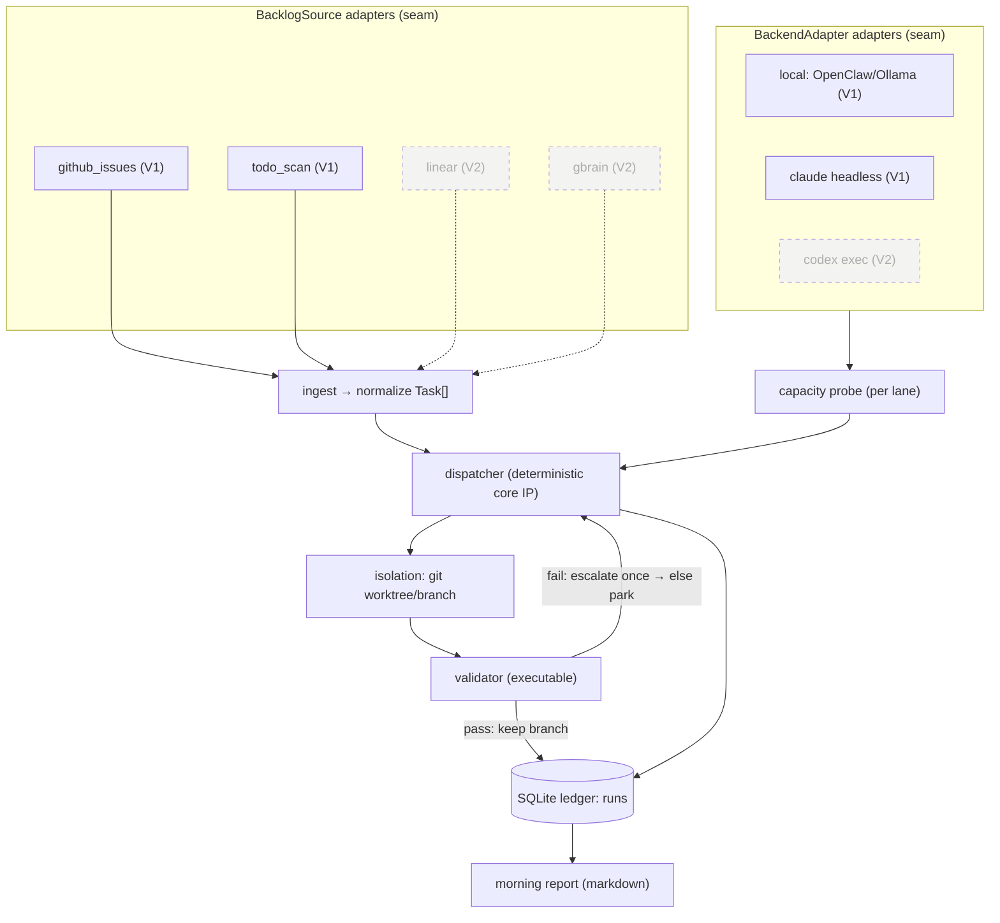
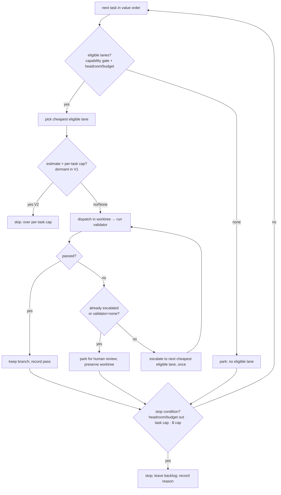
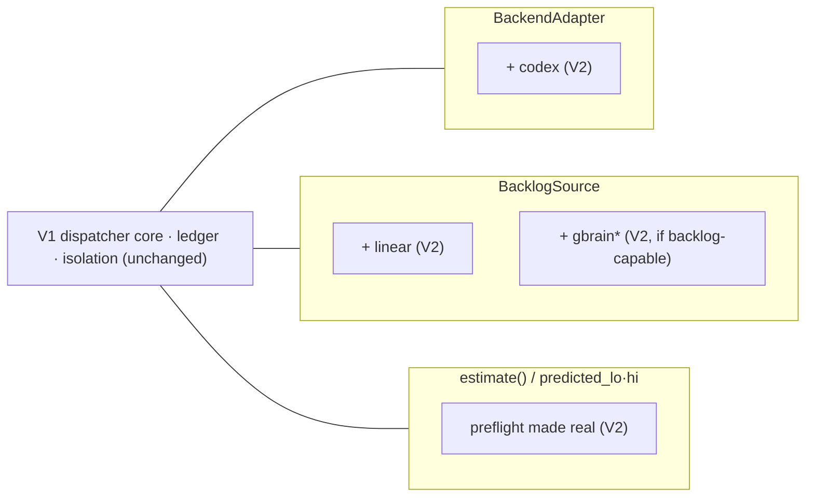

# feat: Nightsweeper — local-first capacity-aware overnight scheduler (V1)

## Summary

Build V1 of Nightsweeper: a local Python CLI, launched nightly by launchd, that pulls a real backlog (GitHub issues + a TODO/FIXME scan), probes which paid-for lane has idle capacity tonight (local Ollama at $0; Claude headless gated by a per-night $ budget), dispatches each task in value order to the cheapest lane that can plausibly clear its validator, validates each result inside an isolated git worktree, leaves a labeled branch per pass, records every attempt in a SQLite ledger, and writes an honest markdown morning report. Two adapter interfaces (`BackendAdapter`, `BacklogSource`) plus a dormant `estimate()`/`predicted_lo/hi` preflight seam are built in V1 so V2 (Codex lane, Linear/Gbrain sources, cost prediction) lands as new adapters with no rewrite.

This plan covers **V1 in build detail** and **V2 as a roadmap whose seams V1 designs in**. Build starts only after this plan is approved; the first milestone is three decision-gating spikes.

---

## Problem Frame

Flat-rate subscriptions plus an always-on Mac are idle, pre-paid capacity overnight, yet no tool matches a real backlog to that capacity and executes it. The scarce resource is idle agent capacity on infrastructure already paid for. V1 must prove the loop end-to-end on a real backlog without inventing work, while honestly reporting consumption — including recommending a downgrade when a paid lane is underused.

---

## Requirements

Traceability to the origin requirements doc (R1–R28). Grouped by concern; R-IDs are the origin's.

**Ingest** — R1 (real sources only, no invented work), R2 (normalize Task shape), R3 (GitHub issues + TODO scan; value from source signals).
**Capacity** — R4 (probe per lane), R5 (budget fallback when headroom opaque), R6 (cloud lanes not free).
**Dispatch (core IP)** — R7 (value order), R8 (cheapest lane with headroom that can plausibly clear the validator; local-first), R9 (deterministic only), R10 (escalate off local only on validation failure, once), R11 (then park).
**Validation & isolation** — R12 (keep only passes), R13 (one worktree/branch per task), R14 (labeled branch; PR opt-in), R15 (preserve parked state).
**Ledger & report** — R16 (`runs` schema incl. nullable `predicted_lo/hi`), R17 (what ran/passed/per-lane consumption/backlog remaining), R18 (downgrade recommendation), R19 (markdown artifact), R20 (consumption never used to rank).
**Config & runtime** — R21 (single `nightsweeper.config.yaml`), R22 (local cron/launchd, no hosted dependency/telemetry), R23 (local SQLite), R24 (nightly task/$ caps + per-task cap as hard stops).
**Guardrails (first-class)** — R25 never invent work, R26 rank by value not tokens, R27 willing to recommend downgrade, R28 local-only-free.

---

## Key Technical Decisions

- **KTD1 — Two adapter seams are the only API-wrapper-shaped code.** `BackendAdapter` exposes `name`, `cost_rank`, `probe_headroom() -> Capacity`, `dispatch(task, workdir) -> Result`, and `estimate(task) -> CostRange | None` (returns `None` in V1). `BacklogSource` exposes `name` and `fetch() -> list[Task]`. Backends and sources are registered in a config-driven registry, so V2 adapters drop in without touching the dispatcher. (R1–R4, see origin.)

- **KTD2 — Claude lane is budget-gated, not live-headroom-gated.** Live remaining headroom is not programmatically readable on a subscription machine (grounding §2), and headless `claude -p` now bills a separate, capped monthly credit (grounding §1). So `probe_headroom()` for the Claude lane returns a **configured per-night $ budget minus tonight's spend so far**; per-run cost comes from `claude -p --output-format json` (`total_cost_usd`). The lane runs **fail-closed**: when the night's budget is spent it stops cleanly. Dispatch runs with `env -u ANTHROPIC_API_KEY` and S1 verifies spend routes to the Agent SDK credit, not uncapped API. (R5, R6, R28.)

- **KTD3 — Local lane = OpenClaw over Ollama; default model Qwen3-Coder-30B, not gemma.** Grounding §3: gemma is not a coding specialist; Qwen3-Coder-30B-A3B is the agentic local workhorse. The model is config-driven; gemma remains selectable as a generalist for non-agentic helper steps. `probe_headroom()` always returns "available, $0". Every local result is gated on **executable** validation, never self-report. (R4, R6, R8.)

- **KTD4 — "Plausibly clear the validator" = a deterministic capability matrix, no ML.** Config maps each lane to the validator types it may attempt and a max task-complexity tier it is trusted for (e.g. local ≤ `medium`, claude ≤ `high`). A lane is *eligible* for a task when it passes the capability gate AND has headroom/budget. The dispatcher picks the cheapest eligible lane; validation + single escalation is the safety net for misclassification. Tasks with `validator: none` cannot be auto-passed and always park for human review. (R8, R9.)

- **KTD5 — Worktree isolation per task, push-then-optional-PR handoff.** `git worktree add .nightsweeper/worktrees/<task-id> -b nightsweeper/<task-id> origin/HEAD`; seed gitignored config via a `.worktreeinclude`-style copy; validate inside the worktree; on pass, `git push -u origin HEAD` then optionally `gh pr create --draft` (config toggle, default off); cleanup with `git worktree remove` + `prune`, resetting any `extensions.worktreeConfig` leftover. (R13, R14, grounding §5.)

- **KTD6 — Runtime: launchd LaunchAgent + caffeinate + pmset, with a scheduler-agnostic flock and sentinel self-heal.** A per-user `StartCalendarInterval` LaunchAgent runs the job under `caffeinate -is`; `pmset repeat wakeorpoweron` guarantees wake; a `flock` lockfile enforces single-instance even under cron/Linux; a sentinel file lets the next launch detect and self-heal a run missed because the Mac was off. (R22, grounding §6.)

- **KTD7 — Stack: Python 3.12 + stdlib + PyYAML.** `subprocess` orchestrates the agent CLIs; `sqlite3` is the ledger; PyYAML reads config. One console-script entrypoint (`nightsweeper`). (R21–R23.)

- **KTD8 — SQLite ledger schema is stable from V1.** `runs(task_id, source, backend, predicted_lo, predicted_hi, consumed, validation_result, passed, escalated, branch, ts)` with `predicted_lo/hi` nullable until V2's preflight populates them. Consumption is recorded for economics only, never used to order tasks. (R16, R20.)

- **KTD9 — Stop conditions are hard and checked every iteration.** A night ends on the first of: all eligible lanes out of headroom/budget; nightly task cap reached; nightly $ cap reached. The remaining backlog is left intact and the stop reason is recorded. (R24, F3.)

- **KTD10 — Preflight hook is present but dormant in V1.** The dispatcher calls `backend.estimate(task)` (returns `None` in V1), records `predicted_lo/hi` (NULL), and contains an inert "skip if estimate exceeds per-task cap" branch. V2 makes `estimate()` real and the branch active — no structural change. (Designs the V2 seam; R16.)

---

## High-Level Technical Design

### Component topology and the V1/V2 seam



Solid = V1; dashed = V2, attaching only at the two seams and the dormant preflight hook.

### Nightly run sequence

```mermaid
sequenceDiagram
  participant LA as launchd (caffeinate)
  participant NS as nightsweeper run
  participant SRC as BacklogSources
  participant CAP as Capacity probe
  participant DSP as Dispatcher
  participant ISO as Worktree
  participant VAL as Validator
  participant LED as Ledger

  LA->>NS: 03:00, flock acquired, sentinel checked
  NS->>SRC: fetch() all sources
  SRC-->>NS: Task[] (or none → "no backlog, no run")
  NS->>CAP: probe_headroom() per lane
  loop tasks in value order, until a stop condition
    NS->>DSP: select cheapest eligible lane
    DSP->>ISO: create worktree/branch
    ISO->>VAL: dispatch(task) then run validator
    alt pass
      VAL-->>LED: record pass; keep branch (push; PR if opted in)
    else fail and not yet escalated
      DSP->>ISO: escalate to next cheapest eligible lane (once)
    else fail again or none-validator
      VAL-->>LED: record parked (preserve worktree)
    end
    NS->>NS: re-check stop conditions
  end
  NS->>LED: write morning report (incl. downgrade rec)
  NS->>LA: write sentinel; release flock
```

### Dispatcher decision flow (the core IP)



---

## Output Structure

```
nightsweeper/
├── pyproject.toml                 # console-script: nightsweeper ; dep: PyYAML
├── nightsweeper.config.example.yaml
├── nightsweeper/
│   ├── __init__.py
│   ├── cli.py                     # run | report | probe | spike | install-scheduler
│   ├── config.py                  # load + validate config
│   ├── models.py                  # Task, Capacity, Result, CostRange, RunRow
│   ├── registry.py                # name → adapter class maps (backends, sources)
│   ├── capacity.py                # budget-fallback bookkeeping
│   ├── dispatcher.py              # deterministic core + stop conditions + escalation
│   ├── isolation.py               # worktree create/seed/cleanup, branch, push, PR
│   ├── validator.py               # run validator inside worktree (executable)
│   ├── ledger.py                  # SQLite schema + writes/reads
│   ├── report.py                  # markdown report + downgrade recommendation
│   ├── adapters/
│   │   ├── backend.py             # BackendAdapter ABC (+ estimate hook)
│   │   └── backlog.py             # BacklogSource ABC
│   ├── backends/
│   │   ├── local.py               # OpenClaw/Ollama
│   │   └── claude_headless.py     # claude -p, budget-gated, fail-closed
│   ├── sources/
│   │   ├── github_issues.py       # via gh CLI
│   │   └── todo_scan.py           # via ripgrep
│   └── scheduling/
│       ├── com.nightsweeper.run.plist.template
│       ├── run.sh                 # flock + caffeinate + sentinel wrapper
│       └── install.py             # render plist, pmset hint
└── tests/
    └── test_*.py                  # mirrors each module
```

Per-unit `**Files:**` are authoritative; the tree is the scope shape.

---

## Implementation Units

Units are grouped into milestones. **Milestone 0 (spikes) gates the rest** — each spike resolves a riskiest assumption before code depends on it. U-IDs are stable.

### Milestone 0 — Spikes (decision gates, before building the lanes they validate)

#### U1. Spike S1 — Claude headless economics + routing verification
- **Goal:** Confirm the Claude lane is economical and bills the Agent SDK credit, not uncapped API.
- **Requirements:** R6, R28; resolves origin assumption "does the June 15 billing change make the Claude lane uneconomical overnight?"
- **Dependencies:** none.
- **Files:** `docs/research/2026-06-15-grounding.md` (append S1 results); throwaway script under `spikes/s1_claude_economics.py` (not shipped).
- **Approach:** Run 3–5 representative small tasks via `env -u ANTHROPIC_API_KEY claude -p --output-format json` in a scratch worktree. Capture `total_cost_usd` and token usage per run. Confirm the spend appears against the Agent SDK monthly credit (check the account/credit surface), not platform.claude.com pay-as-you-go (guards against bug #43333). Extrapolate nightly cost at N tasks vs the $20/$100/$200 credit.
- **Decision gate:** keep the Claude lane on by default with a per-night $ cap (record the recommended cap), or mark it opt-in if uneconomical. Whether to recommend Sonnet/Haiku default + caching.
- **Test scenarios:** `Test expectation: none — spike` (findings recorded in grounding doc, not a shipped unit).
- **Verification:** grounding doc has measured per-task $ cost, routing-destination confirmation, and a recommended nightly cap.

#### U2. Spike S2 — Claude headroom readability
- **Goal:** Determine whether remaining Claude credit/headroom is readable programmatically, or whether budget-fallback is the path.
- **Requirements:** R4, R5.
- **Dependencies:** U1.
- **Files:** `docs/research/2026-06-15-grounding.md` (append S2 results); `spikes/s2_headroom.py`.
- **Approach:** Attempt to read remaining Agent SDK credit balance and/or capture `anthropic-ratelimit-unified-*` headers via `claude --debug api`. Check whether any reliable live-remaining read exists without burning meaningful quota.
- **Decision gate:** Claude `probe_headroom()` = live-read (if found) vs **budget-fallback** (expected, per grounding §2). The architecture (KTD2) assumes budget-fallback; this spike either confirms it or upgrades it.
- **Test scenarios:** `Test expectation: none — spike`.
- **Verification:** grounding doc states the chosen probe mechanism for the Claude lane with evidence.

#### U3. Spike S3 — Local lane pass rate (10-task spike)
- **Goal:** Measure whether the local lane clears enough real tasks to be worth running as the default first lane.
- **Requirements:** R8; resolves origin assumption "does local clear enough real tasks, or does everything escalate?"
- **Dependencies:** none (parallel with U1/U2).
- **Files:** `docs/research/2026-06-15-grounding.md` (append S3 results); `spikes/s3_local_passrate.py`.
- **Approach:** Take 10 real backlog tasks with executable validators. Run each via OpenClaw over Ollama (Qwen3-Coder-30B) in a worktree; record pass/fail by **running the validator**, plus tool-call-failure/loop incidence and latency.
- **Decision gate:** confirm Qwen3-Coder-30B (vs an alternative) as the default local model; set the local lane's max complexity tier from the observed pass-rate-by-complexity; report the pass rate explicitly (the origin's success criterion).
- **Test scenarios:** `Test expectation: none — spike`.
- **Verification:** grounding doc reports the 10-task pass rate and the resulting local-lane capability-matrix entry.

### Milestone 1 — Core scaffolding

#### U4. Project skeleton, config, and models
- **Goal:** Package, config loader, and the core data types every other unit imports.
- **Requirements:** R2, R21–R23.
- **Dependencies:** none.
- **Files:** `pyproject.toml`, `nightsweeper/__init__.py`, `nightsweeper/config.py`, `nightsweeper/models.py`, `nightsweeper.config.example.yaml`, `tests/test_config.py`, `tests/test_models.py`.
- **Approach:** Define `Task` (the normalized shape from R2), `Capacity` (`available: bool`, `dollars_remaining: float | None`, `unit: 'usd' | 'unbounded'`), `Result` (`ok`, `consumed_usd`, `tokens`, `raw`, `error`), `CostRange`, `RunRow`. `config.py` loads `nightsweeper.config.yaml`, applies defaults, and validates: sources, backends + caps, nightly task cap, nightly $ cap, per-task cap, validators, lane capability matrix. Fail with a clear error on malformed config; never silently default a cap to unlimited.
- **Patterns:** stdlib `dataclasses`; `sqlite3` and `subprocess` only; PyYAML `safe_load`.
- **Test scenarios:**
  - Happy: a complete example config loads into a typed object with caps populated.
  - Edge: missing optional source value → configured default applied; missing required nightly $ cap → validation error (not unlimited).
  - Error: malformed YAML → actionable error; unknown backend/source name → error naming the bad key.
  - `Task` normalization rejects an out-of-enum `validator` or `value`.
- **Verification:** `config.load()` returns a validated object for the example config and raises on each malformed fixture.

#### U5. SQLite ledger
- **Goal:** The stable `runs` table and its read/write API.
- **Requirements:** R16, R20.
- **Dependencies:** U4.
- **Files:** `nightsweeper/ledger.py`, `tests/test_ledger.py`.
- **Approach:** Create `runs(task_id, source, backend, predicted_lo, predicted_hi, consumed, validation_result, passed, escalated, branch, ts)` with `predicted_lo/hi` nullable. Provide `record(RunRow)`, `runs_since(ts)`, and per-lane consumption aggregates for the report. Schema created idempotently; a `schema_version` pragma for forward migration. WAL mode.
- **Patterns:** parameterized `sqlite3` queries; no ORM.
- **Test scenarios:**
  - Happy: insert a pass row and a parked row; read both back; per-lane consumption sums correctly.
  - Edge: `predicted_lo/hi` NULL round-trips; `escalated` true/false preserved.
  - Integration: two writes in one night aggregate into the report query.
- **Verification:** schema matches R16 exactly; aggregates feed the report.

#### U6. Adapter interfaces + registry
- **Goal:** The two seams and the config-driven registry that V2 extends.
- **Requirements:** R1–R4; designs V2 seam.
- **Dependencies:** U4.
- **Files:** `nightsweeper/adapters/backend.py`, `nightsweeper/adapters/backlog.py`, `nightsweeper/registry.py`, `tests/test_registry.py`.
- **Approach:** `BackendAdapter` ABC: `name`, `cost_rank: int` (lower = cheaper), `probe_headroom() -> Capacity`, `dispatch(task, workdir) -> Result`, `estimate(task) -> CostRange | None` (default `None`). `BacklogSource` ABC: `name`, `fetch() -> list[Task]`. `registry.py` maps config names → classes for both, instantiated from config. Adding a class + a config entry is the only step to add a lane/source.
- **Technical design (directional):** `estimate()` default returns `None`; the dispatcher treats `None` as "no preflight" — this is the dormant V2 hook (KTD10).
- **Test scenarios:**
  - Happy: a fake backend + fake source register and instantiate from config.
  - Edge: a backend without `estimate` overridden returns `None`.
  - Error: a config naming an unregistered adapter raises at startup, not mid-run.
- **Verification:** registry resolves V1 names; a stub "v2" adapter registers without touching dispatcher code (seam proof).

### Milestone 2 — Backlog sources

#### U7. GitHub issues source
- **Goal:** Fetch real issues as normalized tasks.
- **Requirements:** R1, R2, R3.
- **Dependencies:** U6.
- **Files:** `nightsweeper/sources/github_issues.py`, `tests/test_github_issues.py`.
- **Approach:** Use `gh issue list --json ...` for configured repos/labels. Map issue → `Task`: `value` from a configured label map (e.g. `priority:high → high`) with a default; `validator` from a label or repo default; `est_complexity` from a heuristic (size label / body length) declared as a deferred refinement. Never fabricate a task — empty result yields no tasks.
- **Patterns:** `subprocess` to `gh`; parse JSON only; one command per call (no chaining).
- **Test scenarios:**
  - Happy: a mocked `gh` JSON payload yields correctly normalized tasks with mapped values.
  - Edge: issue with no priority label → default value; no validator label → repo default validator.
  - Error: `gh` not authenticated / non-zero exit → clear error, source contributes zero tasks (does not crash the night).
  - `Covers AE1.` empty issue list → zero tasks (feeds "no backlog, no run").
- **Verification:** real `gh issue list` against the operator's repo returns normalized tasks.

#### U8. TODO/FIXME scan source
- **Goal:** Surface code TODO/FIXME markers as tasks.
- **Requirements:** R1, R2, R3.
- **Dependencies:** U6.
- **Files:** `nightsweeper/sources/todo_scan.py`, `tests/test_todo_scan.py`.
- **Approach:** Scan configured paths with ripgrep for `TODO|FIXME` (pattern configurable). Each hit → `Task` with `id` = stable hash of file+line+text, `value` default (configurable), `validator` default (often `none` → parks). Dedupe by id so the same marker isn't re-queued nightly once a branch exists.
- **Patterns:** `subprocess` to `rg --json`; stable id hashing.
- **Test scenarios:**
  - Happy: a fixture tree with two TODOs yields two tasks with stable ids.
  - Edge: same TODO across runs → same id (dedupe); `validator: none` marker → task that will park.
  - Error: ripgrep absent → clear error; zero matches → zero tasks.
- **Verification:** scanning a sample repo produces stable, deduped tasks.

### Milestone 3 — Backend lanes

#### U9. Local lane (OpenClaw/Ollama)
- **Goal:** The free first-pass lane.
- **Requirements:** R4, R6, R8; consumes S3 (U3).
- **Dependencies:** U6, U3.
- **Files:** `nightsweeper/backends/local.py`, `tests/test_local_backend.py`.
- **Approach:** `probe_headroom()` → `Capacity(available=ollama_up, unit='unbounded', dollars_remaining=None)` (checks the Ollama endpoint is reachable). `dispatch(task, workdir)` → invoke OpenClaw headless against the configured Ollama model (default Qwen3-Coder-30B) inside `workdir`, with a wall-clock timeout and tool-call-loop guard; return `Result(ok=…, consumed_usd=0.0)`. Sandbox the broad permissions to `workdir`.
- **Execution note:** detect tool-call-loop/malformed-tool failures and surface them as a dispatch failure so the dispatcher escalates (don't hang).
- **Test scenarios:**
  - Happy: a stubbed OpenClaw run that edits a file returns `ok=True`, `consumed_usd=0`.
  - Edge: Ollama down → `probe_headroom().available == False` (lane skipped, not crashed).
  - Error/integration: dispatch timeout / tool-call loop → `Result(ok=False)` so the dispatcher escalates.
- **Verification:** a real local task runs end-to-end in a worktree and the validator decides pass/fail.

#### U10. Claude headless lane (budget-gated, fail-closed)
- **Goal:** The cheap-cloud escalation lane.
- **Requirements:** R4, R5, R6, R28; consumes S1/S2 (U1, U2).
- **Dependencies:** U6, U1, U2, U5.
- **Files:** `nightsweeper/backends/claude_headless.py`, `tests/test_claude_backend.py`.
- **Approach:** `probe_headroom()` → `Capacity(available = (nightly_budget - spent_tonight) > 0, unit='usd', dollars_remaining = nightly_budget - spent_tonight)`, reading `spent_tonight` from the ledger (KTD2; budget-fallback per S2). `dispatch(task, workdir)` → `env -u ANTHROPIC_API_KEY claude -p --output-format json --model <configured>` in `workdir`; parse `total_cost_usd` into `Result.consumed_usd`. Fail-closed: if a run would exceed the remaining budget, do not dispatch. Default model from S1 (Sonnet/Haiku unless S1 says otherwise).
- **Execution note:** never set `ANTHROPIC_API_KEY`; assert it is unset before dispatch.
- **Test scenarios:**
  - Happy: stubbed `claude -p` JSON with `total_cost_usd` → `Result.ok`, consumption recorded.
  - Edge: remaining budget below the task's expected floor → lane reports unavailable (fail-closed), task not dispatched here.
  - Error: non-zero exit / unparseable JSON → `Result(ok=False)` with the error; `ANTHROPIC_API_KEY` present → hard refuse with a clear message.
  - `Covers AE5.` headroom unreadable → budget path drives availability.
- **Verification:** a real `claude -p` task runs in a worktree, cost is captured, and the nightly budget decrements.

### Milestone 4 — Isolation and validation

#### U11. Worktree isolation
- **Goal:** One isolated worktree/branch per task, with handoff and cleanup.
- **Requirements:** R13, R14, R15.
- **Dependencies:** U4.
- **Files:** `nightsweeper/isolation.py`, `tests/test_isolation.py`.
- **Approach:** `create(task)` → `git worktree add .nightsweeper/worktrees/<id> -b nightsweeper/<id> origin/HEAD`, seed gitignored config via a `.worktreeinclude`-style copy. `handoff(task, pr_opt_in)` → commit, `git push -u origin HEAD`, then `gh pr create -R <repo> --base <default> --head <branch> --title … --body … --draft --label nightsweeper:<id>` only when opted in; otherwise leave the labeled branch. `cleanup(task, keep)` → on pass `git worktree remove` + `prune`; on park, keep the worktree and record it; reset stray `extensions.worktreeConfig`.
- **Patterns:** grounding §5; one git/gh command per call; resolve repo root via `git rev-parse --show-toplevel`.
- **Test scenarios:**
  - Happy: create → branch+worktree exist under the gitignored dir; pass handoff pushes branch + applies label; cleanup removes worktree and prunes.
  - Edge: PR toggle off → branch pushed, no PR; parked task → worktree preserved.
  - Error: `gh pr create` failure → branch still pushed, error surfaced, night continues; collision on an existing branch id → handled deterministically.
  - Integration: `Covers AE2.` a pass leaves exactly one labeled branch.
- **Verification:** against a scratch repo, a pass yields a labeled branch and a clean worktree list; a park preserves state.

#### U12. Validator
- **Goal:** Run the task's configured validator inside the worktree and decide pass/fail.
- **Requirements:** R12, R15.
- **Dependencies:** U11, U4.
- **Files:** `nightsweeper/validator.py`, `tests/test_validator.py`.
- **Approach:** Map `validator` → command: `test`/`typecheck`/`build` resolve to configured commands; `custom-cmd` runs the task/config-provided command; `none` → cannot pass, returns `parked`. Run inside `workdir` with a timeout; pass iff exit 0. Return a `ValidationResult` consumed by the dispatcher and ledger.
- **Test scenarios:**
  - Happy: a worktree whose failing test now passes → `passed`; a build that succeeds → `passed`.
  - Edge: `validator: none` → `parked` regardless of agent output; validator timeout → `failed`.
  - Error: validator command missing → `failed` with a clear reason (not a crash).
  - Integration: `Covers AE2, AE3.` pass keeps the branch; fail triggers the dispatcher's escalation/park.
- **Verification:** real `pytest`/`tsc`/`make` as validators decide correctly on fixtures.

### Milestone 5 — Dispatcher (core IP)

#### U13. Deterministic dispatcher with escalation and stop conditions
- **Goal:** The value-ordered, capability-gated, local-first matcher with single escalation, parking, and hard stops.
- **Requirements:** R7–R11, R24; F1–F3.
- **Dependencies:** U5, U6, U9, U10, U11, U12.
- **Files:** `nightsweeper/dispatcher.py`, `tests/test_dispatcher.py`.
- **Approach:** Sort tasks by `value` (high→med→low; stable secondary by source order). For each task: compute eligible lanes (capability matrix gate per KTD4 + `probe_headroom().available`); if none, park. Pick cheapest by `cost_rank`. Call `estimate()` (None in V1) and the dormant over-cap skip (KTD10). Create worktree, dispatch, validate. On pass → handoff + record. On fail → if not yet escalated and `validator != none`, escalate to the next cheapest eligible lane once; else park. After each task, re-check stop conditions (KTD9) and break when hit, recording the stop reason. Re-probe budget-based headroom after each Claude run so the $ cap is enforced mid-night.
- **Technical design (directional):** escalation order derives from `cost_rank` over the *currently eligible* lanes, so adding the Codex lane (V2) needs only its `cost_rank` and a matrix row.
- **Test scenarios:**
  - Happy: `Covers AE2.` local clears → no escalation; only local consumption recorded.
  - Edge: `Covers AE3.` local fails → one escalation to Claude → pass keeps branch; fail-again → park (no 2nd escalation).
  - Edge: `Covers AE1.` zero tasks → no run, recorded reason.
  - Edge: `Covers AE4.` Claude budget exhausted mid-night → lane ineligible → remaining cloud-only tasks park or the night stops per KTD9.
  - Edge: `Covers AE7.` task cap / $ cap reached → stop with backlog intact.
  - Error: a lane raising during dispatch is treated as a failure (escalate/park), never crashes the night.
  - Ordering: a low-value task never preempts a high-value one; consumption never affects order (R26).
- **Verification:** a simulated night with fake lanes exercises every AE branch deterministically.

### Milestone 6 — Report

#### U14. Morning report + downgrade recommendation
- **Goal:** The honest markdown artifact.
- **Requirements:** R17–R20, R27.
- **Dependencies:** U5, U13.
- **Files:** `nightsweeper/report.py`, `tests/test_report.py`.
- **Approach:** From the ledger, render: tasks run, passed, parked; per-lane consumption ($ and tokens); backlog remaining; the stop reason. **Downgrade recommendation:** when a paid lane's recent-window utilization (spend vs its configured cap, and pass-contribution) is below a configured threshold over a configured number of nights, emit a recommendation to downgrade that plan, with the underuse evidence. Include a **dormant V2 line** for preflight accuracy (rendered only when `predicted_lo/hi` are populated). Consumption is reported, never used to rank (R20/R26).
- **Test scenarios:**
  - Happy: a mixed night renders all sections with correct per-lane sums.
  - Edge: `Covers AE6.` a chronically underused paid lane → downgrade recommendation present with evidence; a well-used lane → no recommendation.
  - Edge: V2 preflight line absent when predictions are NULL.
  - Error: empty ledger (no-run night) → "no backlog, no run" report (`Covers AE1.`).
- **Verification:** report matches R17–R18 on fixtures; downgrade logic fires only when warranted.

### Milestone 7 — Runtime and end-to-end

#### U15. Scheduler install + single-instance + self-heal wrapper
- **Goal:** Reliable unattended nightly execution.
- **Requirements:** R22, R24.
- **Dependencies:** U13, U14.
- **Files:** `nightsweeper/scheduling/com.nightsweeper.run.plist.template`, `nightsweeper/scheduling/run.sh`, `nightsweeper/scheduling/install.py`, `nightsweeper/cli.py` (`install-scheduler`), `tests/test_scheduling.py`.
- **Approach:** `run.sh` wraps the job in `flock -n` (single-instance), runs `nightsweeper run` under `caffeinate -is`, writes a sentinel timestamp on completion, and on start checks whether the prior night's run was missed (Mac off) and self-triggers if so. `install.py` renders the LaunchAgent plist (`StartCalendarInterval`, `StandardOut/ErrorPath`), prints the `pmset repeat wakeorpoweron` command for the operator to run (needs sudo), and `RunAtLoad=false`, `KeepAlive` unset.
- **Test scenarios:**
  - Happy: `install-scheduler` renders a valid plist with the configured time and log paths.
  - Edge: a second invocation while one runs → flock blocks the second (no overlap); missing sentinel from last night → self-heal triggers one catch-up run.
  - Error: `flock` unavailable → clear message; never silently run two instances.
- **Verification:** plist loads with `launchctl`; flock prevents overlap in a forced-concurrent test.

#### U16. End-to-end dry-run + docs
- **Goal:** Prove the whole loop on a real small backlog and document operation.
- **Requirements:** all V1 R-IDs (integration).
- **Dependencies:** U7–U15.
- **Files:** `tests/test_end_to_end.py`, `README.md` (usage), `CLAUDE.md` (repo agent notes), `nightsweeper.config.example.yaml` (finalized).
- **Approach:** `nightsweeper run --once --dry-fixture` over a scratch repo with seeded issues/TODOs and stub or real lanes; assert branches, ledger rows, and report match expectations across AE1–AE7. Document config, scheduler install, and the morning-report reading.
- **Test scenarios:** `Covers AE1–AE7.` a scripted backlog exercises no-run, local-pass, escalate-pass, escalate-park, budget-exhaustion stop, cap stop, and downgrade recommendation end-to-end.
- **Verification:** one command produces real branches + a real report on the fixture; README documents the nightly setup.

---

## V2 Roadmap (designed-in seams, no rewrite)

Each V2 capability attaches at a seam V1 already builds. None requires changing the dispatcher core, ledger schema, or isolation model.

- **Codex backend lane** — new `BackendAdapter` in `backends/codex.py`. `dispatch` shells `codex exec`; `probe_headroom` scrapes the newest `~/.codex/sessions/**/rollout-*.jsonl` for `token_count.rate_limits` (grounding §4) with budget-fallback, exactly like KTD2. Register it; give it a `cost_rank` and a capability-matrix row. **Spike S4** (before this lane): confirm rollout-JSONL readability from an exec/app-server session vs. infer-from-errors.
- **Linear source** — new `BacklogSource` in `sources/linear.py`; `fetch()` maps Linear issues → `Task` with value/priority from Linear fields. Register it.
- **Gbrain source/enricher** — **Spike S5**: does Gbrain's MCP expose a backlog with value/priority signals, or only memory retrieval? If backlog → a `BacklogSource`; if retrieval only → a read-only context enricher passed into dispatch, **not** a source (honors "never invent work").
- **Preflight cost prediction** — make `estimate(task) -> CostRange` real per backend; the dispatcher already records `predicted_lo/hi` and already has the dormant per-task-cap skip (KTD10). Add predicted-vs-actual logging and the report's preflight-accuracy line. **Spike S6**: on a 20-task replay, does `[predicted_lo, predicted_hi]` bracket actual ≥70%? If not, preflight ships **advisory-only**, not a gate.



---

## Scope Boundaries

**Deferred to Follow-Up Work (V2, same architecture):** Codex lane; Linear source; Gbrain source/enricher; preflight cost prediction + per-task cost cap activation + predicted-vs-actual reporting.

**Outside this product's identity (non-goals, both phases):**
- No generic model router / gateway (commodity — OpenRouter/Portkey own it).
- No request-level optimization for interactive sessions.
- No hosted dashboard, no auth, no multi-tenant — single operator.
- No ML routing — dispatch is deterministic rules only.
- No context-packer — shell out to repomix if ever needed.

---

## Risks & Dependencies

- **Claude lane economics (high).** The $20/$100/$200 monthly credit is small for agentic loops (grounding §1). Mitigation: budget-gated + fail-closed (KTD2), S1 sets a realistic nightly cap and default model, `ANTHROPIC_API_KEY` scrubbed and routing verified.
- **Local pass rate uncertain (medium).** Local SWE-bench-Verified ~52% (grounding §3). Mitigation: S3 measures the real rate; local owns only its proven complexity tier; escalation covers misses; executable validation only.
- **Headroom opacity (medium).** No live read on subscription machines (grounding §2). Mitigation: budget-fallback is the designed default, not a patch.
- **Worktree/runtime footguns (medium).** Shared runtime state, the worktreeConfig leftover bug, sleep/wake misses (grounding §5–6). Mitigation: gitignored worktree dir, cleanup+prune+reset, flock, caffeinate/pmset, sentinel self-heal.
- **External CLI dependencies.** Requires `gh`, `git`, `rg`, `ollama`/OpenClaw, `claude`. Mitigation: each adapter degrades to "contributes nothing / lane unavailable" rather than crashing the night; versions pinned where behavior is fragile (`gh`, `claude`, `codex`).

---

## Open Questions (deferred to implementation)

- Exact complexity-tier heuristic for tasks (size label, body length, file count) — refine during U7/U13; start simple and config-driven.
- The downgrade-recommendation threshold and window (nights, utilization %) — pick a sane default in U14, expose in config.
- `.worktreeinclude` exact match semantics and which gitignored files each task needs — settle in U11.
- Concrete per-night $ cap and default Claude model — set by S1.

---

## Sources & Research

Condensed in `docs/research/2026-06-15-grounding.md`. Load-bearing primaries:
- Anthropic Agent SDK credit / June 15 2026 billing: support.claude.com/en/articles/15036540; thenewstack.io/anthropic-agent-sdk-credits; claude-code issues #37686, #43333.
- Headroom readability: ccusage + `~/.claude/projects/**/*.jsonl`; `anthropic-ratelimit-unified-*` headers; `claude -p --output-format json` (`total_cost_usd`).
- Local agents: Qwen3-Coder-30B / SWE-bench-Verified; OpenClaw (Ollama `/api/chat`, headless).
- Codex headroom: `~/.codex/sessions/**/rollout-*.jsonl` `token_count.rate_limits`; exec emits `rate_limits: null` (issue #14728).
- Worktrees + scheduling: `git worktree`, `gh pr create -R … --head … --draft`; launchd `StartCalendarInterval` + `caffeinate` + `pmset repeat wakeorpoweron`; `flock`; systemd `Persistent=true`.
